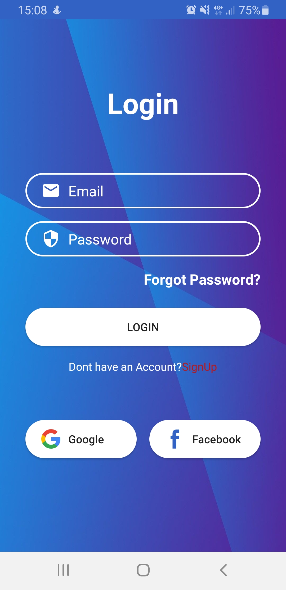
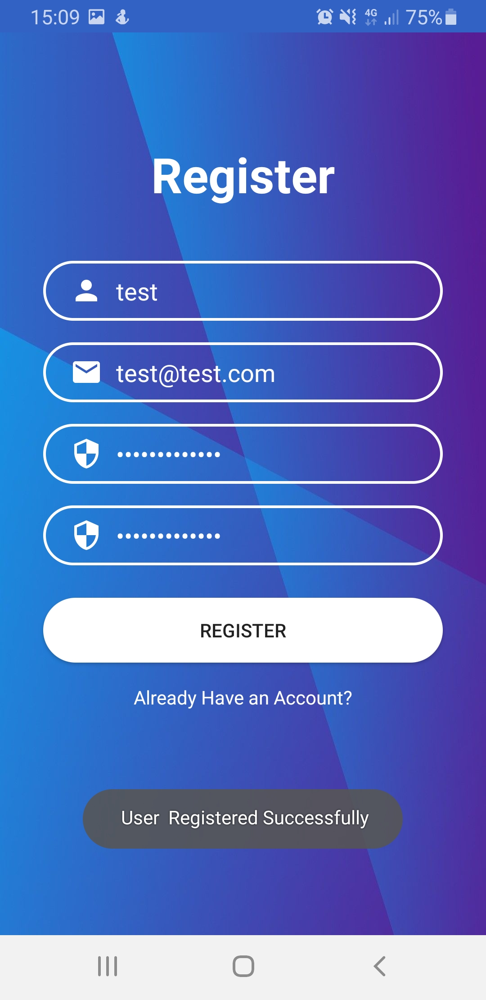
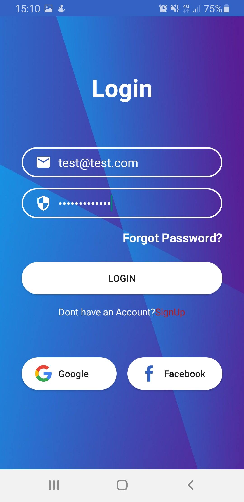
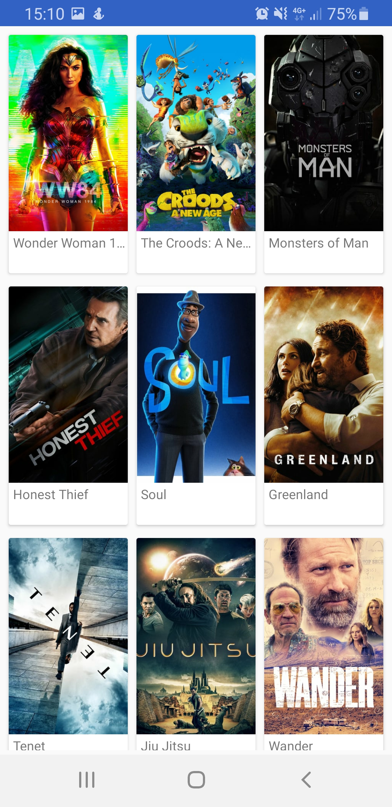
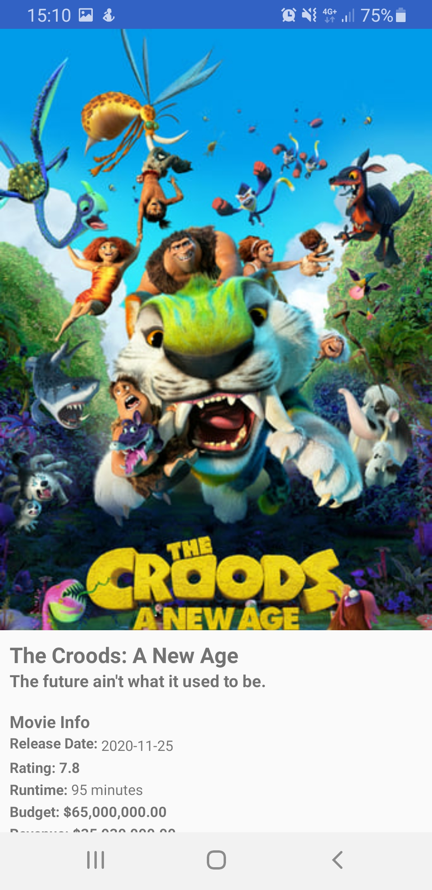
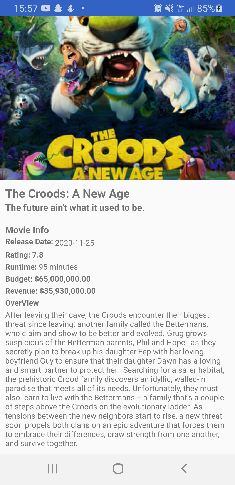

# Projet d'application mobile 4A

## Présentation

Voici mon projet d'application mobile via Android Studio codé en Kotlin.
Cette application affiche une liste de films et propose pour chacun d'entre eux quelques détails sur le film.

Afin de pouvoir acceder à la liste des films, il vous sera nécessaire de vous créer un compte si vous n'en avait pas.


L'application utilise l'Api "themoviedb.org".

## Prérequis

* Installation d'Android Studio </br>
````
 Chemin vers l'Api : https://api.themoviedb.org/3/movie/popular?api_key=38f4762494383020e9deeecb782ac319&page=1 
 
 Api_key : Pour cela vous devrez vous créer un compte sur : https://www.themoviedb.org/,
 puis dans votre compte -> Api -> Generer une Api_key
 
````

## Consignes respectées : 

* Utilisation du language de programmation Kotlin
* Architecture :
	* Design Pattern
	* MVVC
	* Principes(SOLID)
  * Clean Architecture
* Recupération des données via une ApiREST
* Utilisation d'une réelle BDD via l'architecture ROOM
* Affichage d'une liste dans un RecyclerView
* Affichage du détail d'un item de la liste
* Outils supplémentaires :
	* Retrofit
	* Glide
	* Gson
	* Rxjava
	* Coroutine
	

## Fonctionnalités: 
  
  ### Ecran Home 
  
  - Affiche d'une page de log in
  <br>
   
   <br>
  
  ### Ecran Register

- Affichage de la page de création d'un compte
* Configuration nécessaire à la création d'un compte (tous les champs sont obligatoires)
  * Username : comprit entre 4 et 10 caractères
  * Email : Doit respecter le patter suivant xx@xx.xx
  * Password : Doit comporter au minimum 8 caractères dont :
    * 1 caractère numérique
    * 1 lettre miniscule
    * 1 lettre majuscule
    * 1 caractère spéciale
    * Aucun espace vide
  * ConfirmPassword : Doit être identique au password

 
   
   
   
 
 
 ### Ecran liste des films 

- Affichage de la liste des films populaire retourner par l'Api

  <br>
  
  <br>

 ### Ecran détails d'un film 
 
 - Affichage des details récupere sur un film
    * Movie Details :
      * Date de sortie
      * Note
      * Durée
      * Budget 
      * Revenue
      * Résumer


 <!-- Image à gauche -->
 <!-- Image à droite --> 

